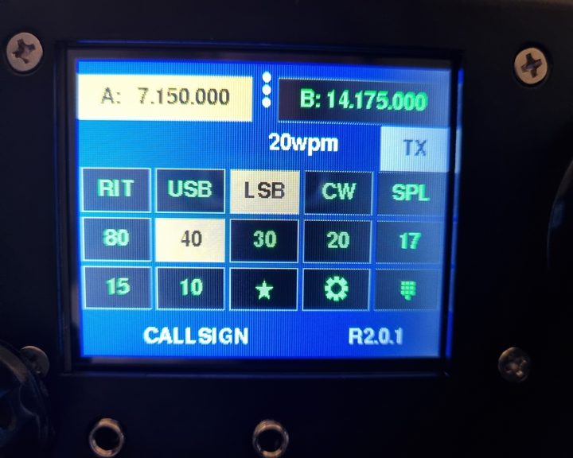
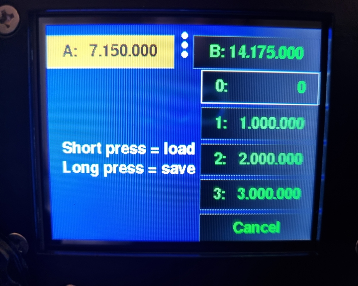
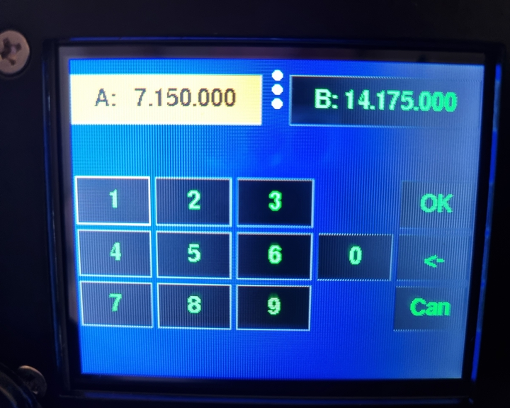
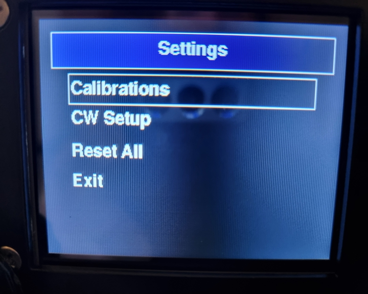
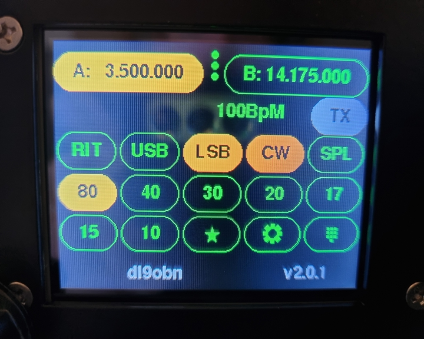
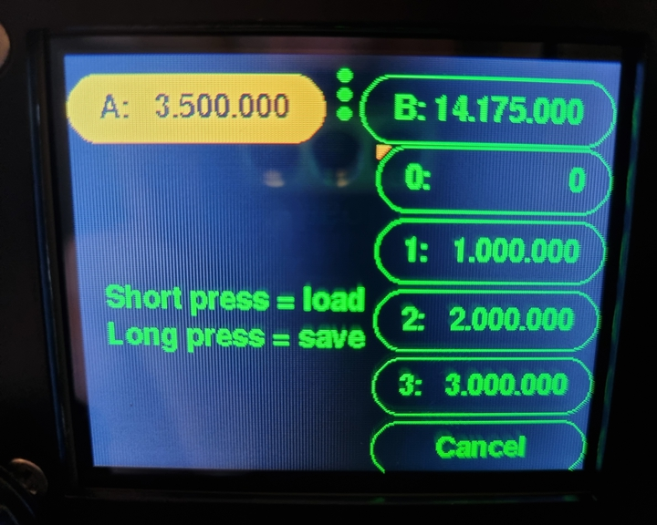
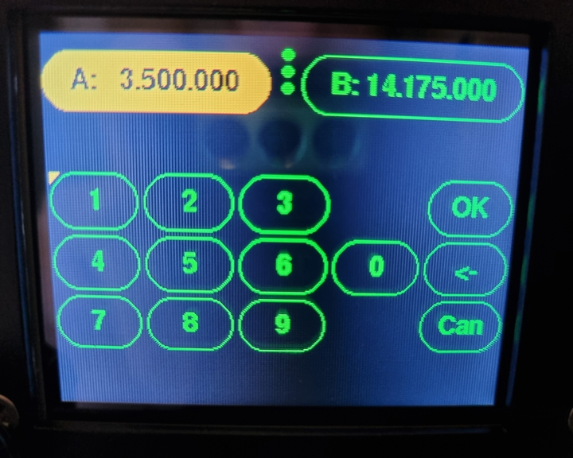
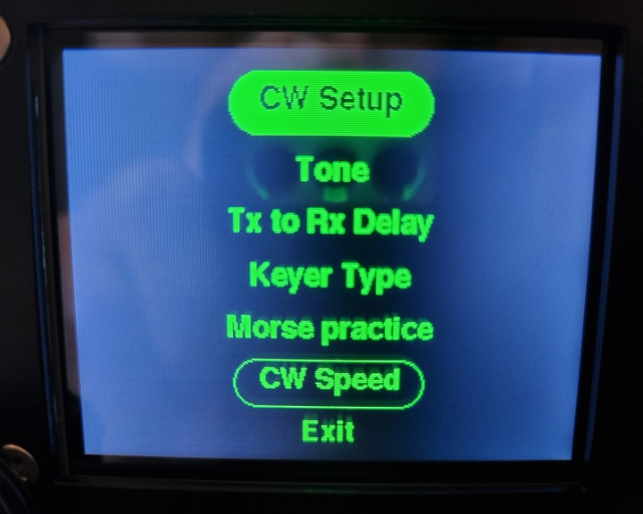

# uBiTXv6 - modified by DL9OBN

The purpose of this fork is to adapt Reed Nightingale's very good and valuable work (https://github.com/reedbn/ubitxv6/) to my personal needs. While adding new functionality I focused on my main operating mode: CW.

New features include:

* A morse practice mode is available, where the TX line is muted while keying CW. The "CW audio mode" has been removed for this.
* Removed the option for "CW keying" with the PTT key, straight key or paddles are to be used for this exclusively.
* Tuning step size can be changed with a short tune button press in the main menu. The tuning step size changes between 10Hz - 20Hz - 50Hz - 100Hz and is displayed by little circles, in the middle between the two VFO frequencies. The "menu selection" mode, where a button is selected by the tune knob, can be entered and confirmed with a long button press of the tune button now.
* When the uBitX is started in CW mode (see `CW_IS_DEFAULT` config value below), the minimum frequency for each band will be used as start frequency.
* Simplified the setting of start frequency when changing bands (mainly to save some memory)
* Added display of current CW speed in the main screen. Since we need the space, the RIT frequency is now always displayed directly under "VFO A".
* Added support for setting the min/max frequencies of all bands, based on the configured IARU region (1/2/3)
* Added a check for the current TX frequency, if we're "out of band" the "TX" button isn't displayed and the TX line is muted.
* The "TX" button is now always visible when the current frequency is valid (see item before), and simply changes its colour when the uBitX goes into "TX" mode.
* Added support for a different GUI theme, which is more based on "Google Materials" (rounded buttons and such). In order for the program to still fit, I had to remove the "calibration" options from the setup menu and had to disable CAT support!

# Installing on your radio

There are plenty of tutorials on how to upload sketches to Arduino Nanos. Just search for them. Addtionally,
Ashhar created a video explaining the process specifically for uBiTX v6: https://www.youtube.com/watch?v=3n_V3prSJ_E

# Personalized config values

To edit e.g. the callsign displayed, open the file `config.h` and change the defines of the config values (defines)

<dl>
<dt>CALLSIGN_TEXT</dt>
<dd>Your callsign as it should be displayed in the main screen.</dd>

<dt>IARU_REGION</dt>
<dd>Sets the limit frequencies (min/max) for all bands according to regulations for regions 1, 2 and 3.</dd>

<dt>DISPLAY_CW_SPEED</dt>
<dd>Change whether you want to display the current CW speed as "wpm", "cpm" or "BpM".</dd>

<dt>CW_IS_DEFAULT</dt>
<dd>If set to "1", the uBitX will start up in CW mode.</dd>

<dt>DEFAULT_TUNING_STEP_SIZE</dt>
<dd>Set the default tuning step size (10Hz, 20Hz, 50Hz or 100Hz).</dd>

<dt>GUI_THEME</dt>
<dd>Set the GUI theming to either "0" (the default) or "1" (Google materials style). Be aware that for the latter option, the calibration and CAT functionalities had to be removed and aren't available!</dd>
</dl>

Then re-compile and upload.

# Comparison of GUI themes

## Default theme

These are some images for the default theme, as was used in the original version by Reed Nightingale.

## New theme

Following some examples of my new theme, using Google Material features like rounded buttons and also
a reduced set of colors.

# License

The majority of this code is released under GPL v3 license, per Ashhar's original code.

The files in the PDQ_MinLib subdirectory were copied from https://github.com/XarkLabs/PDQ_GFX_Libs, and have Adafruit's BSD License.

The files in the toneAC2 were copied from https://bitbucket.org/teckel12/arduino-toneac2/wiki/Home, and are GPL v3 licensed.
